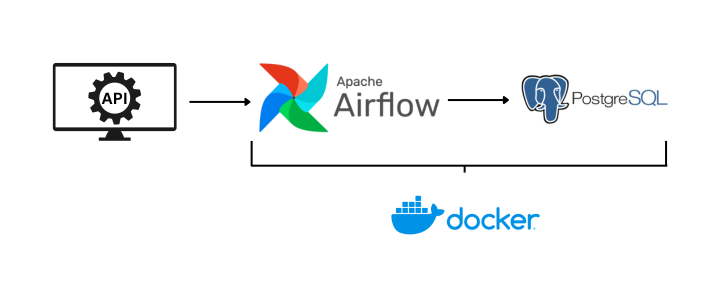

### Pipeline from scratch

This my repository for my Personal Project for learning to Create data Pipelines. In short, this projects aims to ingest crypto currency data from the <a href="https://docs.coincap.io/">CoinCap</a> API to a PostgreSQL Database. We use docker for contenarization, and airflow for the Orchestration.

</img>

I still have a lot to learn about the tools especially airflow, so if any of you guys have any comments or constructing criticism, feel free to reach me in the messages.

Thank you.
